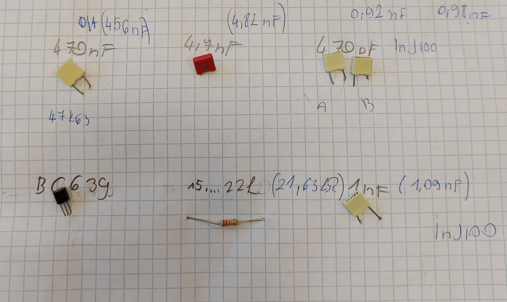

# 1. Projekmunkám 

> készült: 2022.02.16.

## Skori [ Vezeték Nélküli LED meghajtó ] építése / mérése

[VISSZA](https://ciganyvajda2005.github.io/Szabo-Kristof-Portfolio-/).

## Az elkészült áramköreim többféle verzióban is:

## én a 12 voltos feladatot választottam melyhez a táblázatban lévő alkatrészekre volt szügségem

|Név|Jelölés|Érték|darab|
|----|----|----|------|
|Ellenállás|R1|18k|1|
|Kondenzátor|C1|470pF|1|
|Kondenzátor|C2|1nF|1|
|Kondenzátor|C3,C4|4,7nF|2|
|Kondenzátor|C5,C6|470nF|2|
|Tranzisztor|T1|BC639|1 
|Dióda|D1|1n4148|1|

### Alaktrészek kép:

### A kapcsolás megépítéséhez Skori rajzát használtuk fel. 

[Forrás](http://skory.gylcomp.hu/kapcs/kapcs.html).