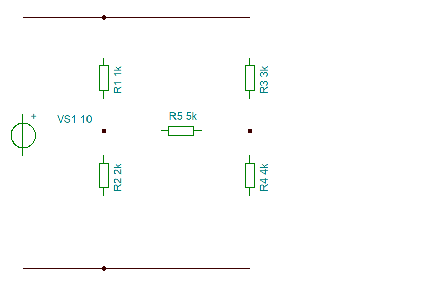
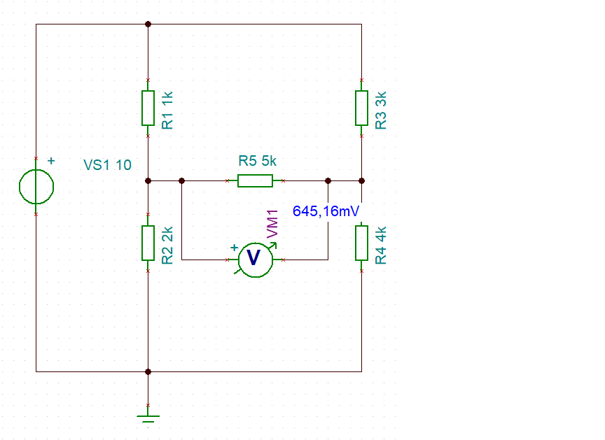
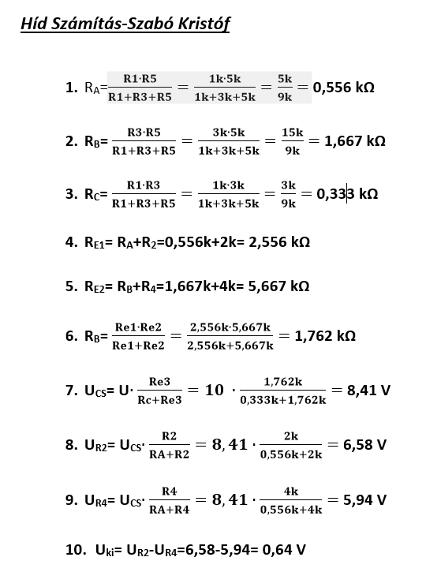

#  2.Projektmunkám 
> készült: 2022.02.16.

# A projekt neve: Hídkapcsolás

## Projekt ismertetése 
### A projekt célja hogy el készítsünk egy kiegyenlítetlen Hídkapcsolást.
#### A legelső pont hogy szimulációs méréssel el készítsük a Hídkapcsolást. (Tina programban)
#### A másdik pont a valós mérés lesz melyet el készítünk laborban.
#### A a harmadik lépés a számítás elkészítése mely lentebb megtalálható egy kép keretében.

 [VISSZA](https://ciganyvajda2005.github.io/Szabo-Kristof-Portfolio-/). 

.

### A legelső nyers változatú kapcsolási rajz mely kisebb át alakításokkal meg kapjuk a végleges formát amit a végén mértünk.

## Alkatrész jegyzék
|Név|Érték|Jelölés|Darabszám|
|---|------|-------|---------|
|Ellenállás|1K|R1|1db|

.

### Ez már a végleges kapcsolási rajz a mért értékkel melyet Voltban mértünk.   Ezek után már az összeállítás következik 

.
### Ezek a projekrhez való számítások melyeket word dokumentumban szerkeztettünk.   A számítások után a valós össze áíítás majd a valós mérés következik.

